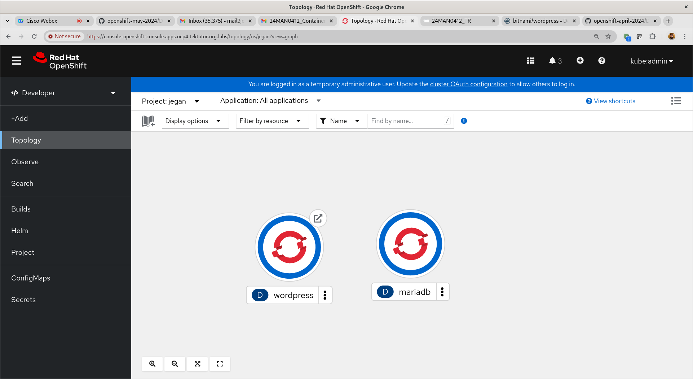
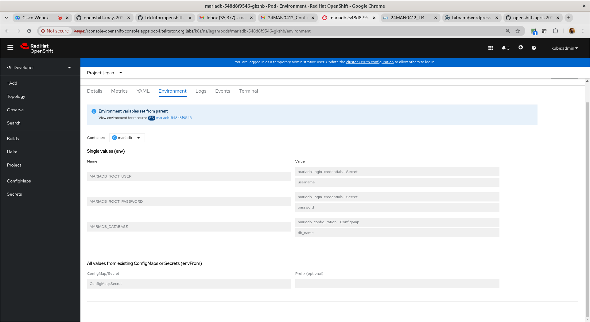
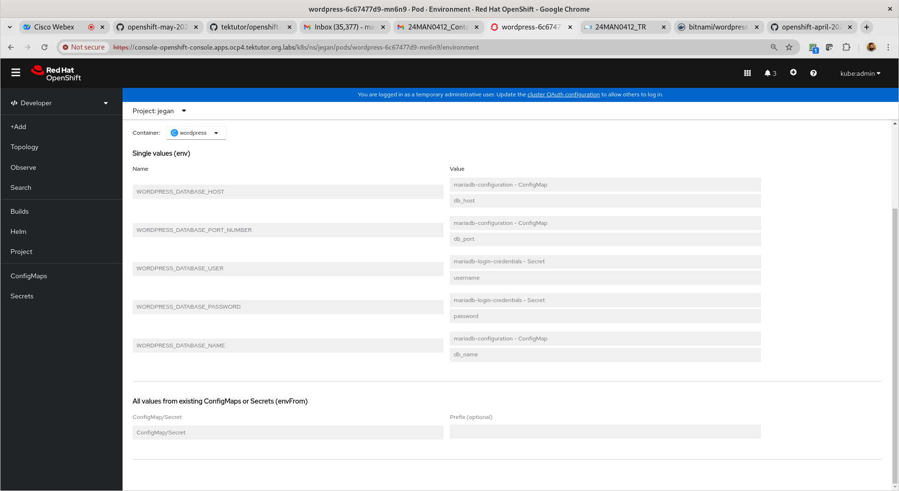

# Day 3

## Info - What is Persistent Volume(PV)?
- Persistent Volume is the disk storage created by the Openshift administrators with cluster-wide access
- Persistent Volume is an external disk storage
- this can be NFS storage, AWS EBS, AWS S3, Azure Storage, etc.,
- Administrators can provision many Persistent volumes either manually or dynamically via storage class

## Info - What is Persistent Volume Claim(PVC)?
- Any stateful application that needs to store data in an external storage has to request for external storage by expressing its requirement in the form of Persistent Volume Claim(PVC)
- This can be done by a developer with non-administrative access
- The PVC name is then used in the application deployment
- OpenShift will search for Peristent Volumes that matches
  - Disk Size
  - Access Mode
  - Label Selector if mentioned
  - Storage Class if mentioned
  - Volume mode if mentioned
- If OpenShift is not able to find a Persistent Volume matching the Persistent Volume Claim defintion, then the Pod that depends on it will be kept in Pending status until OpenShift finds a Persistent Volume matches the Persisten Volume Claim definition.

## Lab - Deploying mariadb db server with persistent volume and claims
```
cd ~/openshift-may-2024
git pull
cd Day3/persistent-volume/mariadb

oc apply -f pv.yml
oc apply -f pvc.yml
oc apply -f mariadb-deploy.yml
```

Expected output
<pre>
[jegan@tektutor.org persistent-volume]$ ls
mariadb-deploy.yml  pvc.yml  pv.yml
  
[jegan@tektutor.org persistent-volume]$ oc apply -f pv.yml 
persistentvolume/mariadb-pv-jegan created
  
[jegan@tektutor.org persistent-volume]$ oc get persistentvolumes
NAME               CAPACITY   ACCESS MODES   RECLAIM POLICY   STATUS      CLAIM   STORAGECLASS   REASON   AGE
mariadb-pv-jegan   100Mi      RWO            Retain           Available      
  7s
[jegan@tektutor.org persistent-volume]$ oc get persistentvolume
NAME               CAPACITY   ACCESS MODES   RECLAIM POLICY   STATUS      CLAIM   STORAGECLASS   REASON   AGE
mariadb-pv-jegan   100Mi      RWO            Retain           Available                                   8s
  
[jegan@tektutor.org persistent-volume]$ oc get pv
NAME               CAPACITY   ACCESS MODES   RECLAIM POLICY   STATUS      CLAIM   STORAGECLASS   REASON   AGE
mariadb-pv-jegan   100Mi      RWO            Retain           Available      
</pre>

Getting inside the mariadb pod shell, type 'root@123' when it prompts for password below
```
oc rsh deploy/mariadb

mysql -u root -p
SHOW DATABASES;
CREATE DATABASE tektutor;
USE tektutor;

CREATE TABLE training ( id INT NOT NULL, name VARCHAR(250) NOT NULL, duration VARCHAR(250) NOT NULL, PRIMARY KEY (id) );
INSERT INTO training VALUES ( 1, "DevOps", "5 Days" );
INSERT INTO training VALUES ( 2, "Linux Driver Development", "5 Days" );
INSERT INTO training VALUES ( 3, "Advanced Linux Internals", "5 Days" );
SELECT * FROM training;
exit
```

## Lab - Deploying a multi-pod wordpress and mariadb blog web site
You need to edit the yml files and replace 'jegan' with your names before proceeding with the below instructions.

```
cd ~/openshift-may-2024
git pull
cd Day3/peristent-volume/wordpress

./deploy.sh
```

Expected output
<pre>
[jegan@tektutor.org wordpress]$ ls
deploy.sh           mariadb-pv.yml   wordpress-deploy.yml  wordpress-route.yml
mariadb-deploy.yml  mariadb-svc.yml  wordpress-pvc.yml     wordpress-svc.yml
mariadb-pvc.yml     undeploy.sh      wordpress-pv.yml
[jegan@tektutor.org wordpress]$ pwd
/home/jegan/openshift-may-2024/Day3/persistent-volume/wordpress
[jegan@tektutor.org wordpress]$ ./deploy.sh 
\nDeploying mariadb sever ...
persistentvolume/mariadb-pv-jegan created
persistentvolumeclaim/mariadb-pvc-jegan created
deployment.apps/mariadb created
service/mariadb created
\nDeploying wordpress server ...
persistentvolume/wordpress-pv-jegan created
persistentvolumeclaim/wordpress-pvc-jegan created
deployment.apps/wordpress created
service/wordpress created
route.route.openshift.io/wordpress created
Warning: apps.openshift.io/v1 DeploymentConfig is deprecated in v4.14+, unavailable in v4.10000+
NAME                             READY   STATUS              RESTARTS   AGE
pod/mariadb-76d9668b99-9zhsn     0/1     ContainerCreating   0          3s
pod/wordpress-79d484b45f-mnwhc   0/1     ContainerCreating   0          1s

NAME                TYPE        CLUSTER-IP       EXTERNAL-IP   PORT(S)    AGE
service/mariadb     ClusterIP   172.30.171.135   <none>        3306/TCP   3s
service/wordpress   ClusterIP   172.30.238.248   <none>        8080/TCP   1s

NAME                        READY   UP-TO-DATE   AVAILABLE   AGE
deployment.apps/mariadb     0/1     1            0           3s
deployment.apps/wordpress   0/1     1            0           1s

NAME                                   DESIRED   CURRENT   READY   AGE
replicaset.apps/mariadb-76d9668b99     1         1         0       3s
replicaset.apps/wordpress-79d484b45f   1         1         0       1s

NAME                                   IMAGE REPOSITORY                                               TAGS     UPDATED
imagestream.image.openshift.io/nginx   image-registry.openshift-image-registry.svc:5000/jegan/nginx   latest   19 hours ago

NAME                                 HOST/PORT                                     PATH   SERVICES    PORT   TERMINATION   WILDCARD
route.route.openshift.io/wordpress   wordpress-jegan.apps.ocp4.tektutor.org.labs          wordpress   8080                 None  
</pre>

At this point, you should be able to click on the wordpress route url to access the wordpress blog page



Once you are done with the exercise, you can delete the wordpress deployment as shown below
```
cd ~/openshift-may-2024
git pull
cd Day3/persistent-volume/wordpress

./undeploy.sh
```

## Lab - Wordpress and mariadb multi-pod application deployment with configmap and secrets
```
cd ~/openshift-may-2024
git pull
cd Day3/persistent-volume/wordpress-with-configmaps-and-secrets

./deploy.sh
```

Expected output
<pre>
jegan@tektutor.org wordpress-with-configmaps-and-secrets]$ ./deploy.sh 
\nDeploying mariadb sever ...
configmap/mariadb-configuration created
secret/mariadb-login-credentials created
persistentvolume/mariadb-pv-jegan created
persistentvolumeclaim/mariadb-pvc-jegan created
deployment.apps/mariadb created
service/mariadb created
\nDeploying wordpress server ...
persistentvolume/wordpress-pv-jegan created
persistentvolumeclaim/wordpress-pvc-jegan created
deployment.apps/wordpress created
service/wordpress created
route.route.openshift.io/wordpress created
Warning: apps.openshift.io/v1 DeploymentConfig is deprecated in v4.14+, unavailable in v4.10000+
NAME                            READY   STATUS              RESTARTS   AGE
pod/mariadb-548d8f9546-kjgq4    0/1     ContainerCreating   0          3s
pod/wordpress-6c67477d9-wx4zh   0/1     ContainerCreating   0          1s

NAME                TYPE        CLUSTER-IP      EXTERNAL-IP   PORT(S)    AGE
service/mariadb     ClusterIP   172.30.51.139   <none>        3306/TCP   3s
service/wordpress   ClusterIP   172.30.249.38   <none>        8080/TCP   1s

NAME                        READY   UP-TO-DATE   AVAILABLE   AGE
deployment.apps/mariadb     0/1     1            0           3s
deployment.apps/wordpress   0/1     1            0           1s

NAME                                  DESIRED   CURRENT   READY   AGE
replicaset.apps/mariadb-548d8f9546    1         1         0       3s
replicaset.apps/wordpress-6c67477d9   1         1         0       1s

NAME                                   IMAGE REPOSITORY                                               TAGS     UPDATED
imagestream.image.openshift.io/nginx   image-registry.openshift-image-registry.svc:5000/jegan/nginx   latest   21 hours ago

NAME                                 HOST/PORT                                     PATH   SERVICES    PORT   TERMINATION   WILDCARD
route.route.openshift.io/wordpress   wordpress-jegan.apps.ocp4.tektutor.org.labs          wordpress   8080                 None
[jegan@tektutor.org wordpress-with-configmaps-and-secrets]$ ./undeploy.sh 
\nUndeploying wordpress server ...
route.route.openshift.io "wordpress" deleted
service "wordpress" deleted
deployment.apps "wordpress" deleted
persistentvolumeclaim "wordpress-pvc-jegan" deleted
persistentvolume "wordpress-pv-jegan" deleted
\nUndeploying mariadb sever ...
service "mariadb" deleted
deployment.apps "mariadb" deleted
persistentvolumeclaim "mariadb-pvc-jegan" deleted
persistentvolume "mariadb-pv-jegan" deleted
configmap "mariadb-configuration" deleted
secret "mariadb-login-credentials" deleted
[jegan@tektutor.org wordpress-with-configmaps-and-secrets]$ ./deploy.sh 
\nDeploying mariadb sever ...
configmap/mariadb-configuration created
secret/mariadb-login-credentials created
persistentvolume/mariadb-pv-jegan created
persistentvolumeclaim/mariadb-pvc-jegan created
deployment.apps/mariadb created
service/mariadb created
\nDeploying wordpress server ...
persistentvolume/wordpress-pv-jegan created
persistentvolumeclaim/wordpress-pvc-jegan created
deployment.apps/wordpress created
service/wordpress created
route.route.openshift.io/wordpress created
Warning: apps.openshift.io/v1 DeploymentConfig is deprecated in v4.14+, unavailable in v4.10000+
NAME                            READY   STATUS              RESTARTS   AGE
pod/mariadb-548d8f9546-tdfdh    0/1     ContainerCreating   0          4s
pod/wordpress-6c67477d9-fnx8z   0/1     ContainerCreating   0          2s

NAME                TYPE        CLUSTER-IP       EXTERNAL-IP   PORT(S)    AGE
service/mariadb     ClusterIP   172.30.107.117   <none>        3306/TCP   3s
service/wordpress   ClusterIP   172.30.210.167   <none>        8080/TCP   1s

NAME                        READY   UP-TO-DATE   AVAILABLE   AGE
deployment.apps/mariadb     0/1     1            0           4s
deployment.apps/wordpress   0/1     1            0           2s

NAME                                  DESIRED   CURRENT   READY   AGE
replicaset.apps/mariadb-548d8f9546    1         1         0       4s
replicaset.apps/wordpress-6c67477d9   1         1         0       2s

NAME                                   IMAGE REPOSITORY                                               TAGS     UPDATED
imagestream.image.openshift.io/nginx   image-registry.openshift-image-registry.svc:5000/jegan/nginx   latest   21 hours ago

NAME                                 HOST/PORT                                     PATH   SERVICES    PORT   TERMINATION   WILDCARD
route.route.openshift.io/wordpress   wordpress-jegan.apps.ocp4.tektutor.org.labs          wordpress   8080                 None  
</pre>

You can verify the mariadb pod environments


You can also verify the wordpress pod environments



## Lab - Deploy our custom multi-pod spring-boot microservice that retrieves data from mariadb
```
oc new-app hello https://github.com/tektutor/openshift-may-2024.git --context-dir=Day3/hello-microservice --strategy=docker
```

Expected output
<pre>
[jegan@tektutor.org openshift-may-2024]$ oc new-app hello https://github.com/tektutor/openshift-may-2024.git --context-dir=Day3/hello-microservice --strategy=docker
error: only a partial match was found for "hello": "tektutor/hello-microservice:1.0"

Argument 'hello' was classified as an image, image~source, or loaded template reference.

The argument "hello" only partially matched the following container image, OpenShift image stream, or template:

* container image "tektutor/hello-microservice:1.0", 51067ff, from local, 393.999mb, buildkit.dockerfile.v0
  Use --image="tektutor/hello-microservice:1.0" to specify this image or template

[jegan@tektutor.org openshift-may-2024]$ oc new-app --name=hello https://github.com/tektutor/openshift-may-2024.git --context-dir=Day3/hello-microservice --strategy=docker
--> Found container image 41ecfe9 (9 days old) from registry.access.redhat.com for "registry.access.redhat.com/ubi8/openjdk-11"

    Java Applications 
    ----------------- 
    Platform for building and running plain Java applications (fat-jar and flat classpath)

    Tags: builder, java

    * An image stream tag will be created as "openjdk-11:latest" that will track the source image
    * A Docker build using source code from https://github.com/tektutor/openshift-may-2024.git will be created
      * The resulting image will be pushed to image stream tag "hello:latest"
      * Every time "openjdk-11:latest" changes a new build will be triggered

--> Creating resources ...
    imagestream.image.openshift.io "hello" created
    buildconfig.build.openshift.io "hello" created
    deployment.apps "hello" created
    service "hello" created
--> Success
    Build scheduled, use 'oc logs -f buildconfig/hello' to track its progress.
    Application is not exposed. You can expose services to the outside world by executing one or more of the commands below:
     'oc expose service/hello' 
    Run 'oc status' to view your app.  
</pre>

You may check the build log as shown below
```
oc logs -f bc/hello
```
